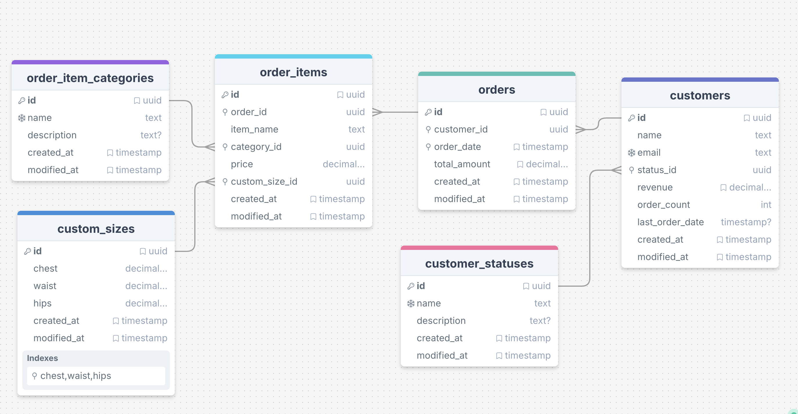

# Collaro Singapore Dashboard Application

### Overview
This project is a dashboard application for Collaro Singapore, built using Nextjs, Tailwind CSS, Material UI and Superbase postghresql database. The application is designed to provide a user-friendly interface for managing and visualizing customer data.

## Part 1 : Project Setup & Mock API Backend

### Objectives
- Set up a Next.js project with Tailwind CSS and Material UI.
- Connect the project to a Superbase PostgreSQL database.
- Create a mock API backend to simulate data fetching.
- Design database schema for customer data.

### Steps

1. **Initialize Next.js Project**
   - Create a new Next.js project using:  
        ```bash
        npx create-next-app@latest collaro-intern-assignment
        ```
   - Navigate to the project directory: 
        ```bash
        cd collaro-intern-assignment
        ```
   - Install Material UI : 
        ```bash
        npm install @mui/material-nextjs @emotion/cache
        ```

2. **Connect Supabase Database**
   - Sign up for a Supabase account and create a new project.
   - Get the API keys and database URL from the Supabase dashboard.
   - Create `.local.env` file in the root of your project and add your Supabase credentials:
        ```bash
        touch .local.env
        ```
    - Add the following lines to `.local.env`:
        ```
        NEXT_PUBLIC_SUPABASE_URL=your_supabase_url
        NEXT_PUBLIC_SUPABASE_ANON_KEY=your_supabase_anon_key
        ```
    - Initialize and configure a Supabase client instance by creating a new file `utils/supabase/server.ts` (server side only):

        ```typescript
        import { createServerClient } from "@supabase/ssr";
        import { cookies } from "next/headers";

        export async function createClient() {
        const cookieStore = await cookies();

        return createServerClient(
            process.env.NEXT_PUBLIC_SUPABASE_URL!,
            process.env.NEXT_PUBLIC_SUPABASE_ANON_KEY!,
            {
            cookies: {
                getAll() {
                return cookieStore.getAll();
                },
                setAll(cookiesToSet) {
                try {
                    cookiesToSet.forEach(({ name, value, options }) =>
                    cookieStore.set(name, value, options)
                    );
                } catch {}
                },
            },
            }
        );
        }
        ```

    - Initialize and configure a Supabase client instance by creating a new file `utils/supabase/client.ts` (client side only):
        ```typescript
        import { createBrowserClient } from "@supabase/ssr";

        const supabaseUrl = process.env.NEXT_PUBLIC_SUPABASE_URL;
        const supabaseKey = process.env.NEXT_PUBLIC_SUPABASE_ANON_KEY;

        export const createClient = () =>
        createBrowserClient(
            supabaseUrl!,
            supabaseKey!,
        );
        ```

3. **Data Modeling :** 
    - Create database schema for customers, orders, and order items in Supabase.
    - Use the Supabase dashboard to create the following tables:
        - `customers`: Contains customer information.
        - `orders`: Contains order details linked to customers.
        - `order_items`: Contains items in each order, linked to orders.
        - `custom_sizes`: Contains custom size information for orders.
        - `customer_statuses`: Lookup table for customer statuses (e.g., prospect, active, churned).
        - `order_item_categories`: Lookup table for item categories (e.g., clothing, accessories).

            

4. **Generate mock data using the `faker` library:**
   - Install the `faker` library:
        ```bash
        npm install faker
        ```
   - Create a script to generate mock data in `scripts/Seed.ts`:

        ```typescript
        require('dotenv').config({ path: './.env.local' }); // Load environment variables from .env

        const { createClient } = require('@supabase/supabase-js');
        const { faker } = require('@faker-js/faker');

        const SUPABASE_URL = process.env.NEXT_PUBLIC_SUPABASE_URL;
        const SUPABASE_ANON_KEY = process.env.NEXT_PUBLIC_SUPABASE_ANON_KEY;

        if (!SUPABASE_URL || !SUPABASE_ANON_KEY) {
            console.error('Error: Supabase URL or Anon Key are not set in .env');
            process.exit(1);
        }

        const supabase = createClient(SUPABASE_URL, SUPABASE_ANON_KEY);

        const NUM_CUSTOMERS = 100; 
        const MAX_ORDERS_PER_CUSTOMER = 5; 
        const MAX_ITEMS_PER_ORDER = 3;


        // Generates a random future or past date within a range
        const getRandomDate = (startOffsetDays = -365, endOffsetDays = 0) => {
            const today = new Date();
            const startDate = new Date(today);
            startDate.setDate(today.getDate() + startOffsetDays); 

            const endDate = new Date(today);
            endDate.setDate(today.getDate() + endOffsetDays); 

            return faker.date.between({ from: startDate, to: endDate });
        };

        async function getLookupTableIds(tableName) {
            const { data, error } = await supabase.from(tableName).select('id, name');
            if (error) {
                console.error(`Error fetching IDs from ${tableName}:`, error);
                return null;
            }
            return data.reduce((acc, item) => {
                acc[item.name] = item.id;
                return acc;
            }, {});
        }

        async function generateAndInsertCustomSize() {
            const customSize = {
                chest: faker.number.float({ min: 30, max: 60, precision: 0.5 }), 
                waist: faker.number.float({ min: 25, max: 50, precision: 0.5 }),
                hips: faker.number.float({ min: 30, max: 60, precision: 0.5 }),
            };
            const { data, error } = await supabase.from('custom_sizes').insert(customSize).select().single();
            if (error) {
                console.error('Error inserting custom size:', error);
                throw error;
            }
            return data;
        }

        // --- Main Seeding Function ---
        async function seedDatabase() {
            console.log('Starting database seeding...');

            // 0. Fetch Lookup Table IDs
            const customerStatusIds = await getLookupTableIds('customer_statuses');
            const itemCategoryIds = await getLookupTableIds('order_item_categories');

            if (!customerStatusIds || !itemCategoryIds) {
                console.error('Failed to fetch required lookup table IDs. Exiting.');
                return;
            }

            const statuses = Object.values(customerStatusIds);
            const categories = Object.values(itemCategoryIds);

            // 1. Generate Customers
            console.log(`Generating ${NUM_CUSTOMERS} customers...`);
            const customersToInsert = [];
            for (let i = 0; i < NUM_CUSTOMERS; i++) {
                const statusName = faker.helpers.arrayElement(['prospect', 'active', 'churned']);
                customersToInsert.push({
                    name: faker.person.fullName(),
                    email: faker.internet.email(),
                    status_id: customerStatusIds[statusName],
                    created_at: getRandomDate(-730, -30), // Customers created between 2 years ago and 1 month ago
                    modified_at: new Date(),
                });
            }
            const { data: insertedCustomers, error: customersError } = await supabase.from('customers').insert(customersToInsert).select();
            if (customersError) {
                console.error('Error inserting customers:', customersError);
                return;
            }
            console.log(`Inserted ${insertedCustomers.length} customers.`);

            // 2. Generate Orders and Order Items for each customer
            for (const customer of insertedCustomers) {
                const numOrders = faker.number.int({ min: 0, max: MAX_ORDERS_PER_CUSTOMER }); // Some customers might have 0 orders
                let customerTotalRevenue = 0;
                let customerOrderCount = 0;
                let customerLastOrderDate = null;

                const ordersToInsert = [];
                const orderItemsToInsert = []; 
                const customSizesToInsert = []; 

                for (let i = 0; i < numOrders; i++) {
                    const orderDate = getRandomDate(-365, 0); // Orders from past year
                    const orderTotalAmount = 0; // Will be summed from order items later

                    const newOrder = {
                        customer_id: customer.id,
                        order_date: orderDate.toISOString(),
                        total_amount: orderTotalAmount, // Placeholder, will update later
                        created_at: orderDate.toISOString(),
                        modified_at: orderDate.toISOString(),
                    };
                    ordersToInsert.push(newOrder);

                    const { data: insertedOrder, error: orderError } = await supabase.from('orders').insert(newOrder).select().single();
                    if (orderError) {
                        console.error('Error inserting order:', orderError);
                        continue; // Skip to next order if this one fails
                    }
                    customerOrderCount++;
                    if (!customerLastOrderDate || new Date(orderDate) > new Date(customerLastOrderDate)) {
                        customerLastOrderDate = orderDate;
                    }

                    const numItems = faker.number.int({ min: 1, max: MAX_ITEMS_PER_ORDER });
                    let currentOrderItemsTotal = 0;

                    for (let j = 0; j < numItems; j++) {
                        const customSize = await generateAndInsertCustomSize(); // Insert custom size first
                        currentOrderItemsTotal += customSize.price || 0; 

                        const itemPrice = faker.number.int({ min: 100, max: 1000 }); // Price for this specific item
                        currentOrderItemsTotal += itemPrice; // Add item's price to current order's total

                        orderItemsToInsert.push({
                            order_id: insertedOrder.id,
                            item_name: faker.commerce.productName(),
                            category_id: faker.helpers.arrayElement(categories),
                            price: itemPrice, // This item's price
                            custom_size_id: customSize.id,
                            created_at: insertedOrder.created_at, // Use order's creation date for consistency
                            modified_at: insertedOrder.modified_at,
                        });
                    }

                    // Update the order's total_amount after all its items are generated
                    const { error: updateOrderError } = await supabase
                        .from('orders')
                        .update({ total_amount: currentOrderItemsTotal })
                        .eq('id', insertedOrder.id);
                    if (updateOrderError) {
                        console.error(`Error updating total_amount for order ${insertedOrder.id}:`, updateOrderError);
                    }
                    customerTotalRevenue += currentOrderItemsTotal; // Add to customer's total revenue

                    // Batch insert all order items for this order
                    const { error: orderItemsError } = await supabase.from('order_items').insert(orderItemsToInsert);
                    if (orderItemsError) {
                        console.error('Error inserting order items:', orderItemsError);
                    }
                    orderItemsToInsert.length = 0; // Clear for next order
                }

                // Update customer's calculated fields after all their orders are processed
                const { error: customerUpdateError } = await supabase
                    .from('customers')
                    .update({
                        revenue: customerTotalRevenue,
                        order_count: customerOrderCount,
                        last_order_date: customerLastOrderDate ? customerLastOrderDate.toISOString() : null,
                    })
                    .eq('id', customer.id);
                if (customerUpdateError) {
                    console.error(`Error updating customer ${customer.id} summary fields:`, customerUpdateError);
                }

                console.log(`Processed orders for customer ${customer.id} (${customer.name}).`);
            }

            console.log('Database seeding complete!');
        }

        seedDatabase().catch(console.error);
        ```

5. **API Endpoint Implementation:**


    **Customer Endpoints**

    - **GET `/api/customers/`**  
    Fetch all customers along with their basic information.

    - **GET `/api/customers/[id]/orders`**  
    Fetch all orders for a specific customer.  
    _Implementation: `src/app/api/customers/[id]/orders/route.ts`_

    - **PATCH `/api/customers/[id]/orders`**  
    Update a customer’s status (`active`, `churned`, or `prospect`).  
    _Implementation: same file as above._

    ---

    **Order Endpoints**

    - **GET `/api/customers/[customerId]/orders/[orderId]`**  
    Fetch details of a specific order belonging to a customer.

    - **GET `/api/customers/[customerId]/orders/[orderId]/items`**  
    Fetch all items within a specific order.

    - **GET `/api/customers/[customerId]/orders/[orderId]/items/[itemId]`**  
    Fetch details of a specific item in an order.

    ---

    **Custom Size Endpoint**

    - **GET `/api/custom-sizes`**  
    Fetch available custom size options.  
    _Note: This endpoint is referenced in the README but appears to be incomplete in the documentation._

### Part 2: Building the Main Customer Data Table

### Objectives
- Implement a responsive customer data table using Material UI.
- Integrate the table with the mock API backend.    

### Steps

1. **Create Customer Data Table Component**
   - Create a new component `CustomerTable.tsx` in the `components` directory.
   - Use Material UI's `DataGrid` to display customer data.
   - Implement sorting, filtering, and pagination features.
    - Fetch customer data from the mock API endpoint `/api/customers/`.
    - Implement a search bar to filter customers by name or email.  
    - Implement a dropdown to filter customers by status (active, churned, prospect).

2. **Implement Customer Detail View**
   - Fetch customer details from the mock API endpoint `/api/customers/[id]`.
   - Display customer information, including their orders and order items.
    - Implement a button to edit customer details, which opens a modal form for editing.

### Part 3: Handling Relational Data with Expandable Rows

### Objectives
- Implement expandable rows in the customer data table to show related orders and order items.  
- Use Material UI's `DataGrid` to handle expandable rows.
### Steps
1. **Implement Expandable Rows**
   - When a row is expanded, fetch and display the customer's orders using the API endpoint `/api/customers/[id]/orders`.
   - For each order, implement a nested expandable row to show order items using the endpoint `/api/customers/[customerId]/orders/[orderId]/items`.

2. **Display Order and Item Details**
   - For each order, display the order date, total amount, and a list of items.
   - For each item, display the item name, category, price, and custom size details.
   - Implement a button to view order details, which opens a modal with more information about the order and its items.

### Part 4: Advanced Inline Editing

### Objectives
- Implement inline editing for customer data, orders, and order items.

### Steps

1. **Inline Editing for Customers**
   - Implement inline editing for customer status and the custom size of a particular order item.